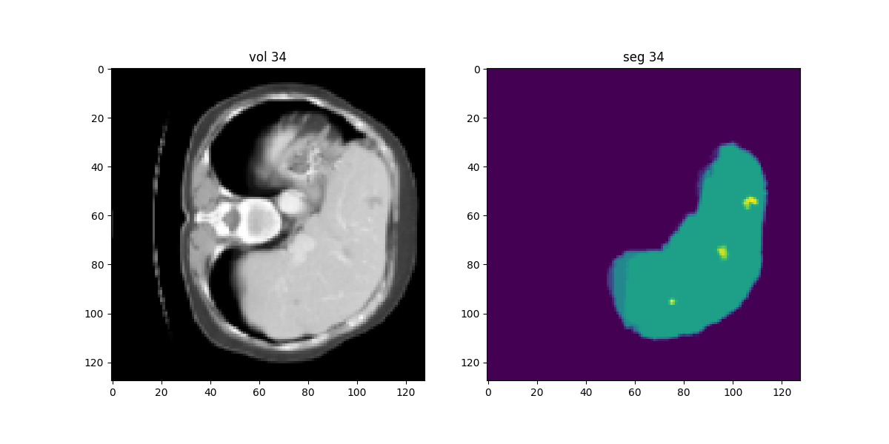

# LiverSegmentation
Using PyTorch and MonAI to perform image segmentation

<div align="center">
  <h1>LiverSegmentation</h1>
  <p>Using PyTorch and MonAI to perform image segmentation</p>
  
</div>

# Data 
<blockquote>
  <p>Antonelli, M., Reinke, A., Bakas, S. et al. The Medical Segmentation Decathlon. Nat Commun 13, 4128 (2022). https://doi.org/10.1038/s41467-022-30695-9 </p>
</blockquote>

Starting with this pre-labled dataset, comprised of 200 patient CAT scans each containing 128 slices, I seperated the data into training and testing splits. From here I preprocessed the images by combining all 128 slices into a compresssed .nii file, and performed the necessary transformations.  
```
train_transforms = Compose(
    [
        LoadImaged(keys=["vol", "seg"]),
        EnsureChannelFirstd(keys=["vol", "seg"]),
        Spacingd(keys=["vol", "seg"], pixdim=pixdim, mode=("bilinear", "nearest")),
        Orientationd(keys=["vol", "seg"], axcodes="RAS"),
        ScaleIntensityRanged(keys=["vol"], a_min=a_min, a_max=a_max, b_min=0.0, b_max=1.0, clip=True), 
        CropForegroundd(keys=["vol", "seg"], source_key="vol"),
        Resized(keys=["vol", "seg"], spatial_size=spatial_size),   
        ToTensord(keys=["vol", "seg"])
    ]
)
```

 

## Model Architecture 

The model that I implemented here is a U-Net architecture. Each layer of the network has a encode and decode path with a skip connection between them. Data in the encode path is downsampled using strided convolutions (if strides is given values greater than 1) and in the decode path upsampled using strided transpose convolutions. These down or up sampling operations occur at the beginning of each block rather than afterwards as is typical in UNet implementations. To further explain this consider the first example network given below. This network has 3 layers with strides of 2 for each of the middle layers (the last layer is the bottom connection which does not down/up sample). Inputdata to this network is immediately reduced in the spatial dimensions by a factor of 2 by the first convolution of the residual unit defining the first layer of the encode part. The last layer of the decode part will upsample its input (data from the previous layer concatenated with data from the skip connection) in the first convolution. This ensures the final output of the network has the same shape as the input.


